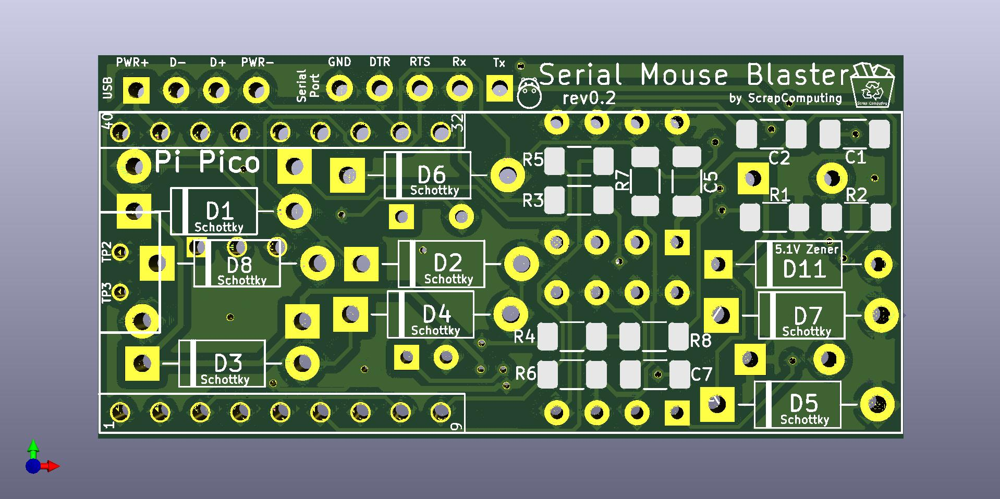
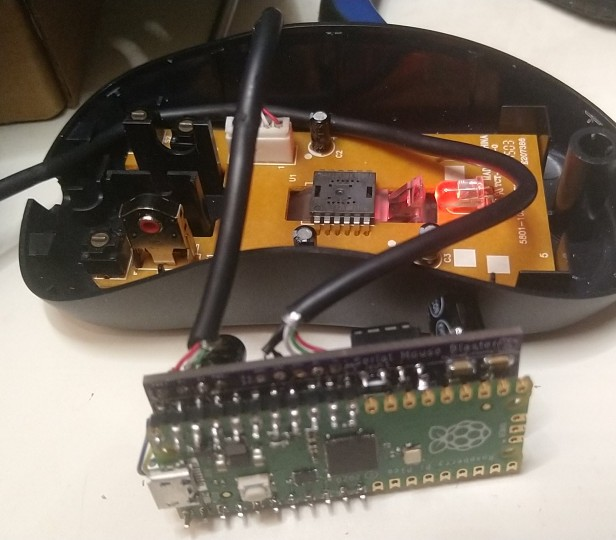
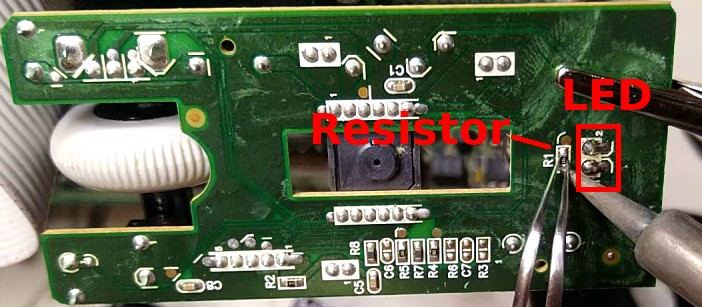

# Serial Mouse Blaster (a.k.a. Passive USB to Serial Mouse Adapter)

A PCB used for modding a modern optical USB mouse and converting it into a Serial mouse.



This is based on a Raspberry Pi Pico running the SerialMouseBlaster [firmware](https://github.com/scrapcomputing/SerialMouseBlasterFirmware).



# What does it do

The SerialMouseBlaster has two jobs:
- It extracts as much current as possible from the serial port pins and provides power to a Raspberry Pi Pico running the specifically designed low-power firmware, and to a USB optical mouse with the LED resistor mod for low power consumption.
- It does the necessary level shifting that allows the Pico's GPIOs to talk to the serial port pins that are used by the serial mouse protocol.

The end result is an adapter board that converts a USB optical mouse to a serial one with no external power.

# Which mouse can I use?

Short answer: You have to measure it first, but a relatively modern mouse with a < 5mA consumption on idle should work after the resistor mod.

The serial port provides very little power, up to 15mA in total at 5V.
Currently the Pico consumes about half of it and the rest of the circuitry about another 15-20%. So the we only have about 5mA to spare for the USB mouse. So a good mouse candidate is one that consumes up to 5mA.

The problem though is that most USB optical mice consume much more than this.
But most of the power is usually consumed by the LED (usually red) which illuminates the surface.
Luckily the mouse camera can still work even with a much dimmer LED.
So we can reduce the power consumption by adding a resistor in series with the LED.
A good resistor values is usually around 1K Ohms.
Some mice may even work with higher resistor values, but beyond some value the camera can no longer see the surface and the mouse will not register mouse movement.
So for best results use the largest resistor value you can without affecting the functionality of the mouse.

Some mice already have an SMD resistor in-series with the LED (see image below of the Microsoft Basic Optical Mouse v2.0).
This resistor is usually a very low value.
For a cleaner mod, you can simply replace this resistor with another SMD one of much higher value.



You can usually tell if a mouse is low-power enough by simply measuring its idle current, without the resistor mod.
If it is under 5mA, then it has a good chance of working well with a mod.
If not, then the chances are that it will consume too much power even with the mod.

Please note that a typical optical USB mouse will consume several times higher power when you move it as the LED becomes a lot brighter than when it is not moving.

## List of mice that work:
 Brand     |  Model                  | Idle Current | Max Current | Mod Resistor |Modded Idle | Modded Max
-----------|-------------------------|--------------|-------------|--------------|------------|-----------
Microsoft  |Basic Optical Mouse v2.0 | 3.5mA        | ~15mA       |  2.2K        | 2.7mA      | 5.4mA


## List of mice that might work:
 Brand     |  Model                  | Idle Current | Max Current | Mod Resistor |Modded Idle | Modded Max
-----------|-------------------------|--------------|-------------|--------------|------------|-----------
Logitech   | B100                    | 8.4mA        | ~24mA       |  1K          | 6.4mA      | 8.6mA

## List of mice that consume too much power (mostly very early optical mice):
 Brand     |  Model                   | Idle Current | Max Current |
-----------|--------------------------|--------------|-------------|
Dell       | M-UVDEL1                 | 20.7mA       | 59.2mA      |
Apple      | A1152                    | 26.7mA       | 69.7mA      |
Microsoft  | Basic Optical Mouse      | 29.4mA       | 54.3mA      |
Microsoft  | Wheel Mouse Optical 1.1A | 44.1mA       | 61.4mA      |

> **Note**
> Please help me populate these tables. Feel free to reach out or send out a pull request if you measured your mouse and you want to share your numbers.

# How does it work

The serial port does not provide power.
So any device connected to it either needs to be powered externally, or try to use power from the logic output pins. There are 3 output pins: TXD, DTR and RTS. These can usually provide up to about 5mA at 5V.

The SerialMouseBlaster uses power from all three pins. When the mouse driver initializes the serial port, DTR and RTS are high (about +10V), while TXD is low (about -10V). In order to get power from TXD, it uses a 7555 timer chip as a voltage doubler, which outputs positive voltage.

Level-shifting is done with an LM385 Op Amp which consumes only 1.5mA, as opposed to using a MAX3232, which according to my measurements consumed more than 5mA.


# Serial port pinout

Pin | Name | Direction | Description
----|------|-----------|------------
  1 | CD   | IN        | Carrier Detect
  2 | RXD  | IN        | Receive Data
  3 | TXD  | OUT       | Transmit Data
  4 | DTR  | OUT       | Data Terminal Ready
  5 | GND  |           | Ground
  6 | DSR  | IN        | Data Set Ready
  7 | RTS  | OUT       | Request To Send
  8 | CTS  | IN        | Clear To Send
  9 | IR   | IN        | Ring Indicator

```
Female connector looking at the holes:
 -----------------------
|     -------------     |
|     \ 5 4 3 2 1 /     |
| ( )  \ 9 8 7 6 /  ( ) |
|        -------        |
 -----------------------
```

# Videos
- For a discussion/explanation of the circuit: https://www.youtube.com/watch?v=cGvVPzlRPjM
- Assembly video rev0.1: https://www.youtube.com/watch?v=YjD63UplQ3c


# Bill of materials

Gerber files are published in the releases: https://github.com/scrapcomputing/SerialMouseBlasterPCB/releases

The firmware is available here: https://github.com/scrapcomputing/SerialMouseBlasterFirmware

Reference      | Quantity| Value    | Footprint
---------------|---------|----------|----------
C1             | 1       |     100nF| Capacitor SMD 1206
C2             | 1       |      10nF| Capacitor SMD 1206
C3 C4 C6 C8    | 4       |      10uF| Capacitor SMD 1206
C7             | 1       |       1uF| Capacitor SMD 1206
D11            | 1       |BZX84-C5V1| Diode SMD SOT-23_ANK
D1 D2 D3 D4 D5 | 5       |  BAS40-04| Package SMD SOT-23
Q1             | 1       |   MMBTA92| Package SMD SOT-23
R1             | 1       |      4.7K| Resistor SMD 1206
R2             | 1       |       47K| Resistor SMD 1206
R3             | 1       |        1K| Resistor SMD 1206
R4             | 1       |      100K| Resistor SMD 1206
R5 R6 R7       | 3       |       22K| Resistor SMD 1206
R8             | 1       |        1K| Capacitor SMD 1206
U1             | 1       | ICM7555xP| Package SO-8 5.3x6.2mm P1.27mm
U2             | 1       |     LM358| Package SO-8 5.3x6.2mm P1.27mm
U3             | 1       |Raspberry Pi Pico| Raspberry Pi Pico
J1             | 1       |Conn_01x05| (Optional) Connector Male PinHeader 1x05 P2.54mm Vertical
J2             | 1       |Conn_01x04| (Optional) Connector Male PinHeader 1x04 P2.54mm Vertical
J3             | 1       |Conn_01x03| (Optional) Connector Male PinHeader 1x03 P2.54mm Vertical

# Changelist
- Rev0.1 : Initial revision (not released)
- Rev0.2 : Initial release. Fixes minor issues of Rev0.1.