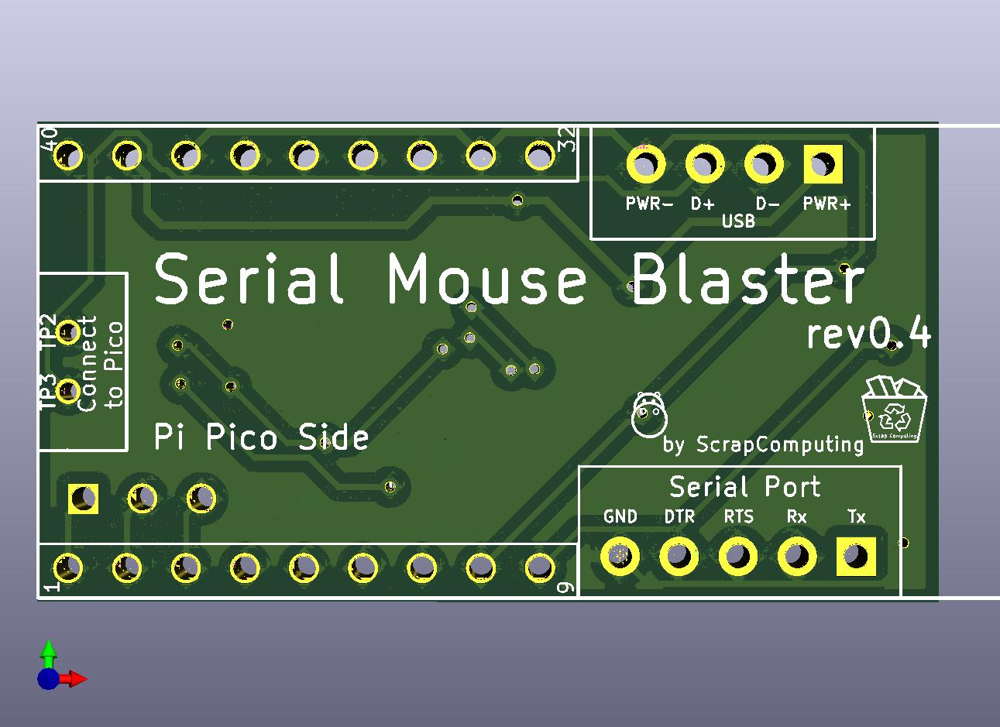
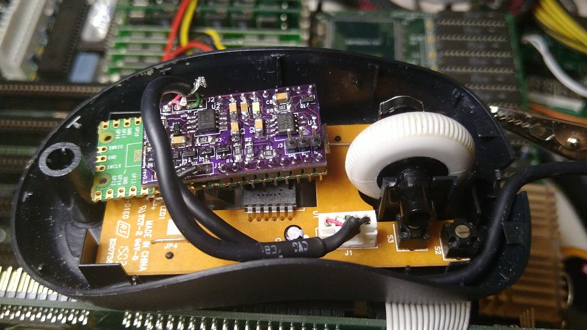

# Serial Mouse Blaster (a.k.a. Passive USB to Serial Mouse Adapter)

A PCB used for modding a modern optical USB mouse and converting it into a Serial mouse.



This is based on a Raspberry Pi Pico running the SerialMouseBlaster [firmware](https://github.com/scrapcomputing/SerialMouseBlasterFirmware).



# What does it do

The SerialMouseBlaster has two jobs:
- It extracts as much current as possible from the serial port pins and provides power to a Raspberry Pi Pico running the specifically designed low-power firmware, and to a USB optical mouse with the LED resistor mod for low power consumption.
- It does the necessary level shifting that allows the Pico's GPIOs to talk to the serial port pins that are used by the serial mouse protocol.

The end result is an adapter board that converts a USB optical mouse to a serial one with no external power.


# How does it work

The serial port does not provide power.
So any device connected to it either needs to be powered externally, or try to use power from the logic output pins. There are 3 output pins: TXD, DTR and RTS. These can usually provide up to about 5mA at 5V.

The SerialMouseBlaster uses power from all three pins. When the mouse driver initializes the serial port, DTR and RTS are high (about +10V), while TXD is low (about -10V). In order to get power from TXD, it uses a 7555 timer chip as a voltage doubler, which outputs positive voltage.

Level-shifting is done with an LM385 Op Amp which consumes only 1.5mA, as opposed to using a MAX3232, which according to my measurements consumed more than 5mA.


# Serial port pinout

Pin | Name | Direction | Description
----|------|-----------|------------
  1 | CD   | IN        | Carrier Detect
  2 | RXD  | IN        | Receive Data
  3 | TXD  | OUT       | Transmit Data
  4 | DTR  | OUT       | Data Terminal Ready
  5 | GND  |           | Ground
  6 | DSR  | IN        | Data Set Ready
  7 | RTS  | OUT       | Request To Send
  8 | CTS  | IN        | Clear To Send
  9 | IR   | IN        | Ring Indicator

```
Female connector looking at the holes:
 -----------------------
|     -------------     |
|     \ 5 4 3 2 1 /     |
| ( )  \ 9 8 7 6 /  ( ) |
|        -------        |
 -----------------------
```

# Videos
- For a discussion/explanation of the circuit: https://www.youtube.com/watch?v=cGvVPzlRPjM


# Bill of materials

Gerber files are published in the releases: https://github.com/scrapcomputing/SerialMouseBlasterPCB/releases

The firmware is available here: https://github.com/scrapcomputing/SerialMouseBlasterFirmware

  Name  | Item                       |  Value   |     Package            | # | Description
--------|----------------------------|----------|------------------------|---|--------------------------------------------------------
 U3     | Raspberry Pi Pico          |          |                        | 1 |
R8,R9   | Resistor                   |   1M     | SMD 1206               | 2 |
 R4     | Resistor                   | 100K     | SMD 1206               | 1 |
 R2     | Resistor                   |  47K     | SMD 1206               | 1 |
R5,R6,R7| Resistor                   |  22K     | SMD 1206               | 3 |
 R1     | Resistor                   | 4.7K     | SMD 1206               | 1 |
 R3     | Resistor                   |   1K     | SMD 1206               | 1 |
 U2     | IC LM358                   |          | DIP8                   | 1 | Op-Amp
 U1     | IC 7555                    |          | DIP8                   | 1 | CMOS Timer
U1,U2   | DIP 8 IC Sockets           |          | DIP8                   | 2 | Sockets for the ICs
C4,C6   | Electrolytic Capacitor 25V | 470uF    | Through-hole Radial    | 2 | 16V caps should also work
 C8     | Electrolytic Capacitor 6.3V| 100uF    | Through-hole Radial    | 1 |
 C3     | Electrolytic Capacitor 25V |  10uF    | Through-hole Radial    | 1 | 
C5,C7   | Ceramic Capacitor      50V |   1uF    | SMD 1206               | 2 |
 C1     | Ceramic Capacitor      50V | 0.1uF    | SMD 1206               | 1 |
 C2     | Ceramic Capacitor      50V |  10nF    | SMD 1206               | 1 |
 D9     | Diode 1N4001               |          | Through-Hole           | 1 | Generic diode
 D11    | Zener Diode 1N5231         |  5.1V    | Through-hole Axial     | 1 |
D1,D2,D3,D4,D5,D6,D7,D8,D10 | Schottky Diode 20V | 1N5817   | Through-hole Axial     | 9 | 
 N/A    | Male Header 2.54mm pitch   | 01x09    | Through-hole 2.54mm    | 2 | Headers for attaching the Pico to the PCB
 J3     | Male Header 2.54mm pitch   | 01x03    | Through-hole 2.54mm    | 1 | Optional (for serial debugging)

# Changelist
- Rev0.1 : Initial revision (not released)
- Rev0.2 : Initial release. Fixes minor issues of Rev0.1.